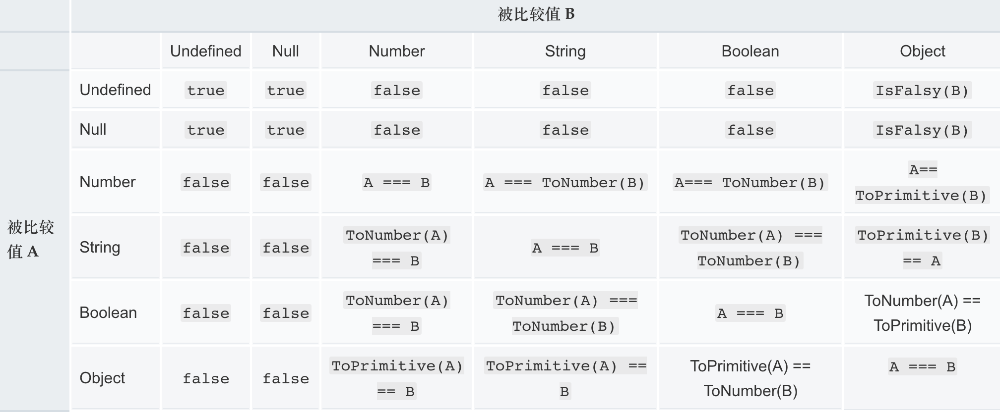
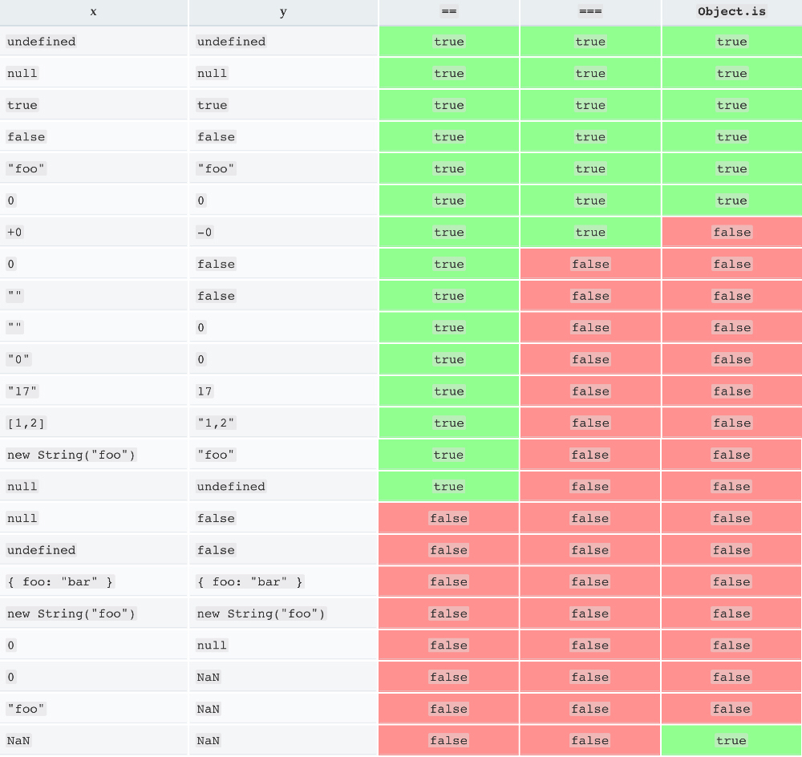

## javascript 基础内容

重新系统性的学习js基础内容

### 原始类型

null, undefined, string, symbol, number, boolean

js中的原始类型就只有这6个，在原始类型上面他是不存在任何方法的，因为在存储方式上他只是存下了对应类型的值，对不是一个对象，或者说一个地址
所以在原始类型上面是不会有任何方法存在，即undefined.toString()，是会报错的


但是有人会有疑问，这样子明明是可以的

``` javascript

    '2'.toString() // 2

```

这是因为在js中 '2' 已经被转换成Object类型，toString是在Object原型链上的方法并不是原始类型中的string类型，所以才能够使用toString

但是这个时候又有另一个问题，你说'2'是被转成了object，那么，为什么typeof确是显示string的呢

``` javascript

    typeof '2' // string

```

那是因为 '2' 转成成的object实际上是 String继承了Object而生成的对象，typeof 判断的实际上是一个表达式, typeof '2', 判断的是'2'运行之后的结果，即String类型的'2'运行的结果为原始类型的string，所以typeof这时候就判断出'2'为string类型

那么，好学的人又有疑问了，为什么会出现下面这种情况呢, 这说明null不是原始类型吗？

``` javascript

    typeof null // object

```

这就涉及到了typeof的创始问题了，在js创始初期，typeof null就被定义为object，那时候，js中的值是一个表示类型的标签和实际数值表示的
对象的类型标签是0，而null代表的是空指针大多数平台下值为 0x00），因此，null 的类型标签是 0，typeof null 也因此返回 "object"。[参考链接](https://2ality.com/2013/10/typeof-null.html)

### Object

说完基本类型，就不得不考虑我们的object符合类型了，在js中有一句话很有标志性`万物皆对象`。

因为在我们写代码的过程中，使用的过程中，基本上都是基于object来实现，不管是数组，函数还是各种类型，都是基于object去扩展

对于对象来说，他存储的方式与原始类型不同，原始类型存储的是他的值，就是 `const a = 1` 那么，在存储的时候他就是一个值就是1，
但是对于对象来说 `const a = {b: 1}` ，那么a存储的就是这个object的地址，当这个对象在赋值给其他变量的时候，对象中的值变化了，
那么，所有指向这个地址的变量中的值都会发生改变

``` javascript

    const a = {
        b: 1
    }
    const b = a;

    b.b = 2;

    console.log(a) // {b: 2}

```

那么有什么办法能够让被赋值的变量与原变量没有关联呢

#### 深拷贝

深拷贝是将一个变量中的所有属性全部拷贝出来，然后存到另一个变量中，从而使原地址跟现地址没有关联，据我所知方法一共好几种，但是各自有各自的缺陷

1. JSON

这种方法能够将对象的原地址改变，但是由于使用JSON也有一定的问题

- 忽略`undefined`
- 无视`function`
- 不管`symbol`
- 不能复制原型链上的数据

所以一般情况都是只用于对于简单的json数据的深拷贝

``` javascript

    const a = {b: 1};
    const b = JSON.parse(JSON.stringify(a));
    b.b = 2;
    console.log(a.b); // 1
    console.log(b.b); // 2

```

2. MessageChannel

messageChannel的具体介绍[请戳这里](https://developer.mozilla.org/zh-CN/docs/Web/API/MessageChannel);

``` javascript

function structuralClone(obj) {
  return new Promise(resolve => {
    const { port1, port2 } = new MessageChannel()
    port2.onmessage = ev => resolve(ev.data)
    port1.postMessage(obj)
  })
}

var obj = {
  a: 1,
  b: {
    c: 2
  }
}

obj.b.d = obj.b

// 注意该方法是异步的
// 可以处理 undefined 和循环引用对象
const test = async () => {
  const clone = await structuralClone(obj)
  console.log(clone)
}
test()

```

3. 自己实现深拷贝

通过递归以及原型链上的方法获取将一个对象的所有属性赋值给另一个对象, 但是在实际开发过程中我更推荐使用[lodash](https://lodash.com/docs#cloneDeep),

``` javascript
// 不考虑任何边界情况的简单深拷贝
function deepClone(obj) {
    if (typeof obj !== 'object') {
        return obj;
    }

    const isArray = Array.isArray(obj);
    const clone = isArray ? [] : {};

    if (isArray) {
        obj.map(item => {
            clone.push(typeof item !== 'object' ? item : deepClone(item));
        })
    } else {
        // 返回所有属性（不包含继承属性）
        Reflect.ownKeys(obj).map(key => {
            clone[key] = typeof obj[key] !== 'object' ? obj[key] : deepClone(obj[key])
        })
    }
    return clone;
}

```

### Reflct

Reflect 是一个内置的对象，它提供拦截 JavaScript 操作的方法。这些方法与处理器对象的方法相同。Reflect不是一个函数对象，因此它是不可构造的
[具体内容](./reflect.html)

### 原型链

原型链是js中的一个重要的概念，贯穿了整个js的实现周期以及继承组合等各种知识的基础
[具体内容](./prototype.html)

### == 和 === 

js里面有两种比较运算符， == 和 ===，一个是相等一个是全等，这两个最大的区别在于，==符号两边如果数据类型不同会进行类型转换，而===符号则不会，他会严格的校验左右两边的数据类型以及数值，只要其中一个对不上则直接返回false

这里我们只分析==符号中的数据转换，而不去对===做分析，因为===实在是太简单了



在这里就衍生出了一个js的面试题 （[] == ![]） = true

为什么会等于true呢？

首先我们先看一下在`==`运算符里面，`![]`是什么，这里就要先了解一下!运算符具体是怎么实现的逻辑

! 代表着非，即反向的意思，在js里面所有的变量前面都可以添加！用来取反

在没有`==`运算符的时候，[]代表的是true因为实际上创建的时候就已经分配了地址，那么它本身就是一个存在的数，所以在碰上！运算符之后，
`![]`就变成了false

而在`==`运算符中会对不同类型的做类型转换 即`[] == ![]`实际上变成了 `[] == false`，也就是boolean与array类型做对比，那么按照上图的分析

[] 会进行转换，`[].toString() = ''`， 首先变成了一个空字符串，然后将空字符与false进行对比`'' == false`, 就变成了 `false == false` ，结果就为true

### Object.is

与 === ， == 运算符相对应的还有一个Object上的is方法，这个方法与他们最大的区别在于

1. 区分了 -0，+0
2. NAN

即，Object.is(NAN, NAN) === true， Object.is(-0, +0) === false



由图可以看出，Object.is与===基本上是等效的，唯一区别就是上面说的两个内容，那么什么时候用is什么时候用===呢？

Object.is毕竟走的是函数调用，那么势必会比===的js表达式来的慢一些，虽然在正常的代码中不会觉得慢到哪里去，但是不管从速度还是美观度上而言，我推荐优先选择===只有在全等符号不满足的情况下再去考虑is方法
